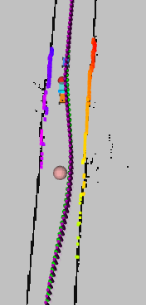
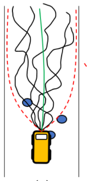

## MPPI with Control Barrier Functions (Shield MPPI) for F1Tenth car

### Building: 
1. Clone this repo
2. This repo uses some custom message types for communication, defined here: https://github.com/vaithak/f1tenth_icra_race_msgs
   ```
   git clone git@github.com:vaithak/f1tenth_icra_race_msgs.git
   colcon build --packages-select=f1tenth_icra_race_msgs
   ```
3. Build the package
   ```
   colcon build
   source install/local_setup.bash
   ```

### Running
- Launch the object and tracking subsystems
  `ros2 launch f1tenth_icra_race r3.oo.launch.py`
- Launch the spliner and state machine
  `ros2 launch f1tenth_icra_race r3.ss.launch.py`
- Launch the shield mppi controller
  `ros2 launch f1tenth_icra_race r3.c.launch.py`

### Subsystems and workings
- **Opponent Detection and tracking:**
    
    - It uses a clustering method with an adaptive breakpoint algorithm to create bounding box  
      rectangles for obstacles.
    - Uses a simplified Extended Kalman Filter for Velocity tracking (assumes a single obstacle).
    - Implemented in C++ for realtime performance of 50Hz.
    - Reference: https://github.com/kostaskonkk/datmo
- **Spline-based real-time planner and state machine:**
    
    - Real-time updating of local waypoints if an obstacle is detected in front of the car.
    - Decides which side to overtake from and fits a cubic spline to update the waypoints.
    - State machine to decide when to trail vs when to overtake
    - Reference from ForzaETH: https://arxiv.org/abs/2403.11784
- **Shield MPPI-based controller:**
    
    - MPPI with control barrier functions for following the raceline and avoiding obstacles.
    - Local repair minimization step using CBFs is only done when the trajectory follows undesired behavior.
    - Reference of Shield MPPI: https://arxiv.org/abs/2302.11719

### Working demo on sim
[shield mppi](https://github.com/user-attachments/assets/b5d3f740-e091-4092-b12f-3779751e319c)

### Working version on a real car
[](https://www.youtube.com/watch?v=V5UYKdPNC0Q)  

